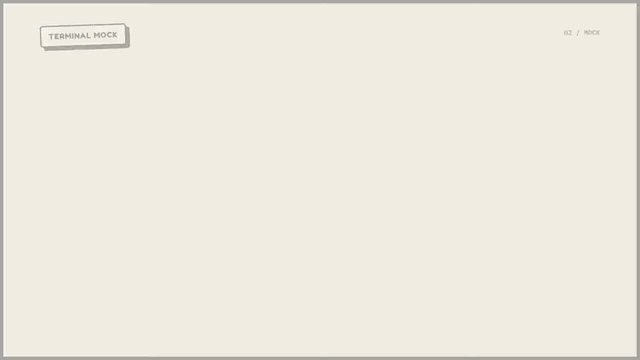
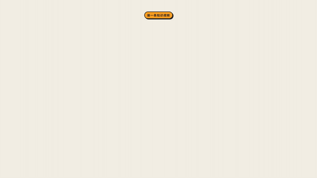
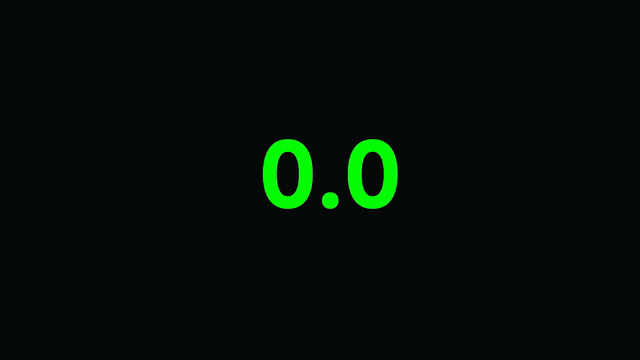
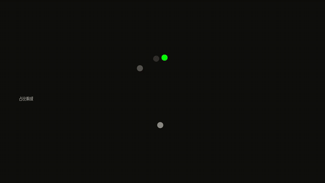
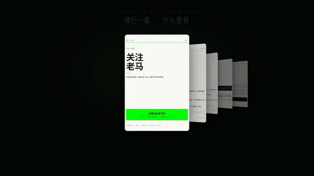
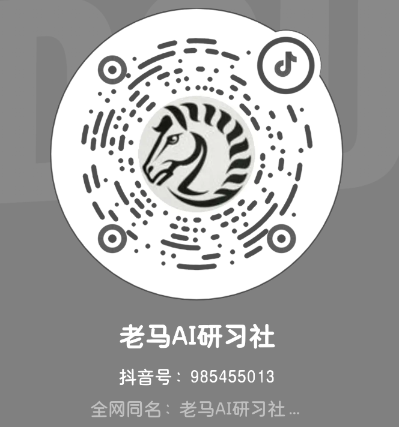
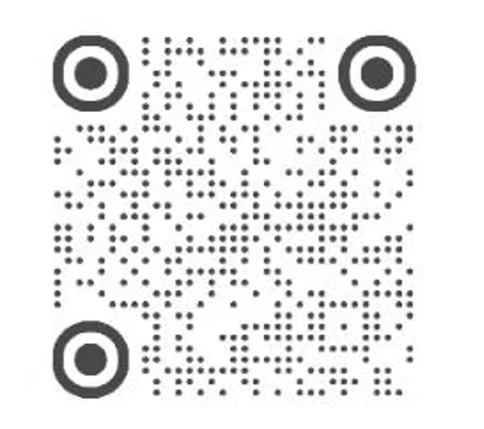

# Motion Prompts · 视频动效提示词（178 个全量开源）

挑一个提示词，粘贴给任意 AI（Claude Code / Codex / 豆包 / DeepSeek……），
AI 会输出一个自包含的动效 HTML 页面——浏览器打开即播放，录屏进剪辑软件直接用。

**不需要 Claude 和 Codex。豆包、DeepSeek 也能一键出片。**

**🎬 在线预览全部动效 → https://motion.maning789link.top**

## 快速开始

1. 先去[预览站](https://motion.maning789link.top)看动效长什么样；
2. 从 [SAMPLES.md](SAMPLES.md) 挑一个，复制 `.md` 文件里分隔线以下的整段提示词；
3. 粘贴发给你的 AI，不需要任何额外解释；
4. AI 输出 HTML 存成文件，浏览器打开播放，录屏即成片。

生成的页面是 1920×1080 横屏，文案、数字、颜色都集中在文件顶部的 JS 常量里，随改随用。

## 效果预览

GIF 有压缩，预览站里是 1080p 原片：

| 终端打字演示（奶油版） | 前后数据对比（奶油版） |
|:---:|:---:|
|  |  |
| **大数字卡** | **环形占比图** |
|  |  |
| **封面流转播** | **档案照片放大聚焦** |
|  |  |

## 本仓有什么

- `prompts/` —— **178 个提示词，全量开源**：
  - 标准版 88 个：数据可视化、知识讲解、产品演示、标题开场、流程图、信息卡片，暗色科技风；
  - 奶油贴纸版 90 个：同一批场景的浅色奶油风版本，气质更软，适合生活方式、情感、轻知识内容。
  全部开箱即用。
- `SAMPLES.md` —— 总目录（编号 / 名称 / 分类 / 时长）

## 后续版本怎么领

本仓会持续周更，但**完整版不是一次性全放，而是逐步开放**——
生产 Skill、后续新模板族、以及 26 套成片流水线，**在知识星球逐步开放**，
星球入口在社区公布：

- **社区（主阵地）**：更新通知、答疑，知识星球入口在社区发；
- **个人微信**：会员 / 定制咨询；
- **抖音 / 小红书**：只看更新预告，完整内容不在那边发。

上不去 GitHub 的，也可以在公众号「老马AI研习社」后台领同一份打包。

> 我的全网账号统一为「老马AI研习社」（公众号 / 抖音 / 小红书），谨防假冒。

## 扫码联系

| 社区 · 完整版逐步开放 + 星球入口 | 个人微信 · 会员 / 定制咨询 |
|:---:|:---:|
|  |  |
| **抖音 · 更新预告** | **小红书 · 更新预告** |
|  |  |

## 一个模板玩 20 分钟，和一条片 3 分钟的区别

单个提示词复制粘贴就能用。但如果你做内容更新，真正的痛点从来不是"出一个动效"，
而是**每周都要出一整条片子**：

- 写完文章，还要手动拆点、选镜头、逐条调文案、逐个录屏、再进剪辑软件拼——
  一条 60 秒的片子，动效部分能吃掉一下午；
- 想保持风格统一？每个镜头的配色、字体、节奏都得人肉对齐；
- 口播配音和画面对轨，又是一场手工拉锯。

这套模板库配套的生产 Skill 解决的就是这件事：把一篇文章丢给装了 Skill 的 AI，
它自动**提炼内容 → 按镜头语言选模板 → 逐镜渲染 → 抽帧验收 → 拼接成片 → 配音混轨**，
你喝一杯咖啡，成片出来了。支持指定文案、指定图片、指定每镜时长的定制交付。

**Skill、会员动效系列与成片流水线 → 知识星球逐步开放，入口见社区（上方「扫码联系」）**

## 更新路线图（持续上新，周更）

五个新模板族制作中，完成一族上线一族（预览站先看，完整版在知识星球逐步开放）：

| 模板族 | 数量 | 适合内容 |
|---|---|---|
| 公文表单风 | 6~8 | AI 落地、职场、管理叙事（红章盖戳 / 删除线批注 / 整改建议单） |
| 玻璃拟态展示 | 6~8 | 产品 / SaaS / App 展示（环绕光源 / 边缘点火 / 折射玻璃球） |
| 档案拼贴风 | 8~10 | 犯罪、历史、科普纪录片（档案印章 / 红线地图 / 报纸剪贴） |
| 白板手账黄卡 | 5~6 | 知识科普（概念定义卡 / 步骤链条 / 章节路线图） |
| 3D 呼吸 Hero | 1~2 | 开场封面（技术验证中） |

最新更新：免费版 178 个（标准版 88 + 奶油贴纸版 90）全量开源（2026-08）。

## 本地渲染（可选）

提示词生成的 HTML 用浏览器录屏就能用；要直接出 MP4，可用 hyperframes 渲染器。
我们备好了**免 npm 的离线环境包**（内置浏览器，解压即用，全程不联网），
领取方式见预览站首页说明。

## 许可（摘要，以 LICENSE 全文为准）

- ✅ 提示词可自由使用，**生成的视频可商用**（接单、广告、发平台都行）；
- ❌ 禁止将提示词本身打包转售，或搬运到其他提示词站/付费社群再分发；
- ❌ 禁止删除文件中的溯源标识、禁止冒用「老马AI研习社」名义；
- ℹ️ 模板依赖的字体（MiSans / 美呗嘿嘿体）、GSAP、hyperframes 均为第三方组件，
  受各自许可约束，字体文件不随本仓分发。

觉得有用就 Star 一下，预览站会持续上新。
